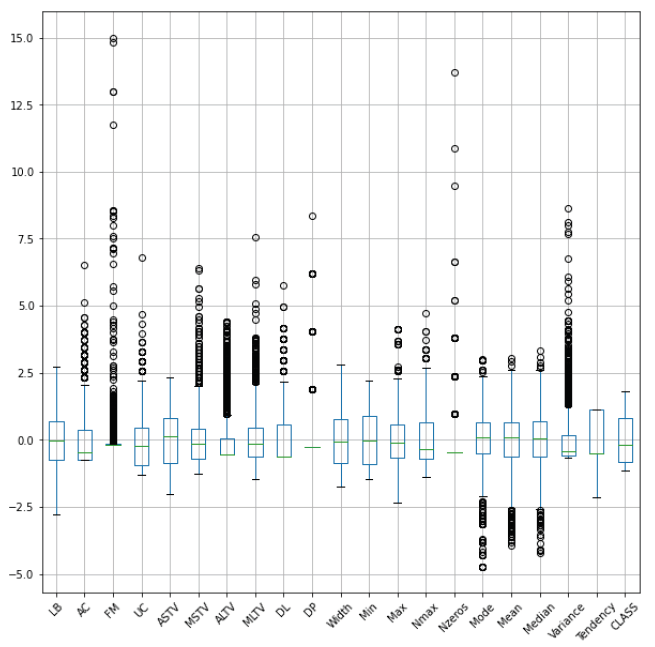
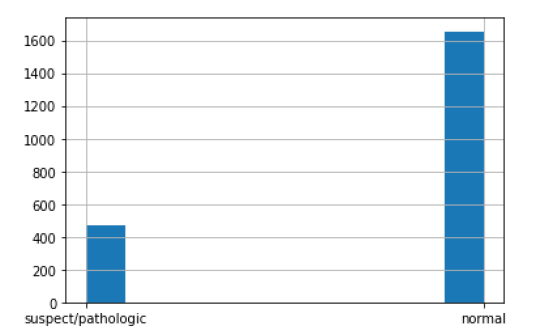
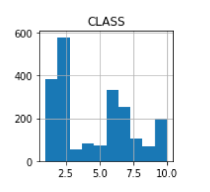
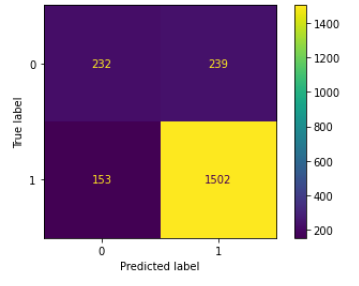

# Intelligent Analysis of Prenatal Data Using Clustering and Deep Learning

This project presents a comprehensive analysis of the **Cardiotocography dataset** using a wide range of **data preprocessing, clustering, and classification techniques**. The goal is to identify patterns and build predictive models that can assist in the evaluation of fetal health status, using advanced machine learning methods and visualizations.

## 📊 Dataset

- **Source:** UCI Machine Learning Repository – Cardiotocography Dataset
- **Samples:** 2,126 fetal monitoring records
- **Features:** 21 numerical attributes extracted from cardiotocograms
- **Target Variables:**
  - `NSP` (Fetal state): Normal (1), Suspicious/Pathological (0) – Binary classification
  - `CLASS` and `FHR` were also analyzed during clustering

## ⚙️ Project Structure

- `CTG.xlsx`: Raw dataset with multiple sheets (description, normalized data, raw data)
- `EDA_and_Clustering.ipynb`: Exploratory data analysis, data preprocessing, and clustering
- `Classification_Keras.ipynb`: Neural network-based classification using Keras
- `plots/`: Visualizations of feature distributions, clustering results, and classification performance

## 🔍 Methodology

### 1. **Data Preprocessing**

- Selection of 21 key features from the raw dataset
- Removal of irrelevant or duplicate entries
- Missing value handling and outlier detection
- Normalization techniques applied:
  - Min-Max Scaling
  - Max Scaling
  - Robust Scaling
- Statistical tests for normality (Kolmogorov–Smirnov, Shapiro–Wilk)
- Label transformation of `NSP` for binary classification (Normal vs. Non-Normal)

### 2. **Clustering**

Applied unsupervised learning techniques to identify structure in data:

- **Algorithms used:**
  - K-Means
  - Spectral Clustering
  - Birch
  - DBSCAN
  - Agglomerative (Ward) Hierarchical Clustering
- **Dimensionality Reduction:**
  - Principal Component Analysis (PCA)
- **Evaluation Metrics:**
  - Confusion Matrix
  - Class-wise prediction accuracy

#### 📈 Clustering Visuals

<div align="center">
  <br>
  <em>Box Plot of Features</em>
</div>

<div align="center">
  <br>
  <em>Histogram of NSP Class</em>
</div>

<div align="center">
  <br>
  <em>Histogram of FHR Class</em>
</div>


<div align="center">
  <br>
  <em>Confusion matrix of Birch algorithm with PCA applied on selected characteristics (components=3)</em>
</div>


**Notable Findings:**
- Birch with PCA on selected features yielded the best balanced clustering performance.
- Min-max scaling outperformed robust scaling for hierarchical clustering.

### 3. **Classification**

A deep learning model was built using **Keras**:

- **Model Type:** Fully connected feedforward neural network
- **Optimization:** Tuning of layers, neurons, activation functions, batch size, epochs
- **Preprocessing:** Robust scaling yielded better generalization
- **Evaluation Metrics:** Accuracy, Loss, Confusion Matrix, Recall

**Best Architecture Highlights:**

- Multiple hidden layers with uniform neuron distribution
- Validation loss stabilized after certain epoch/complexity thresholds
- Trade-off observed between validation loss and model accuracy

## 📈 Results

- Clustering achieved partial separation between fetal states, with best performance using Birch + PCA.
- Neural network classifier reached high accuracy and generalization for binary fetal health prediction.
- Visualization of predictions, confusion matrices, and training curves are included in the notebooks.

## 🛠️ Technologies Used

- **Python 3**
- **Jupyter Notebook**
- **Pandas, NumPy, Matplotlib, Seaborn**
- **Scikit-learn**
- **TensorFlow / Keras**

## 🚀 How to Run

1. Clone the repository:
   ```bash
   git clone https://github.com/ebakiris/data-analytics-and-machine-learning-project.git
   cd data-analytics-and-machine-learning-project
2. Install required libraries:
    ```bash
    pip install -r requirements.txt
3. Open and run the notebook:
    ```bash
    jupyter lab
